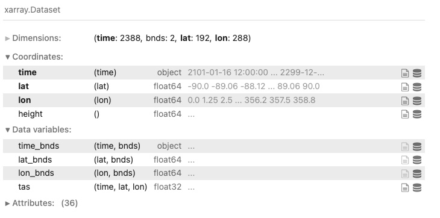
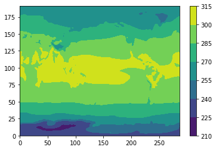
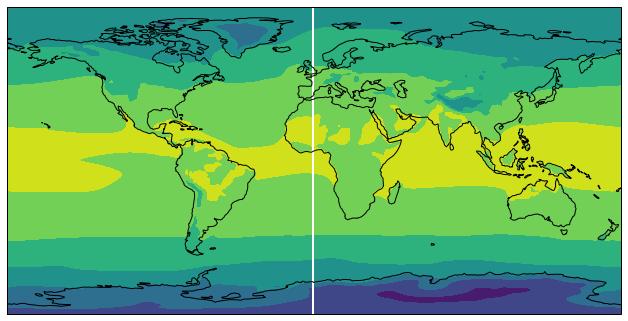
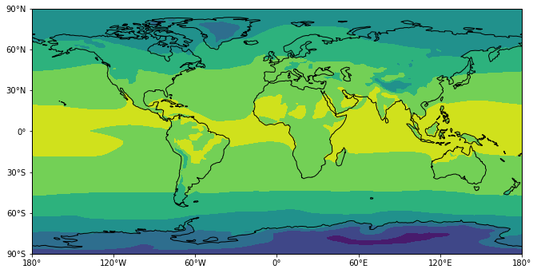
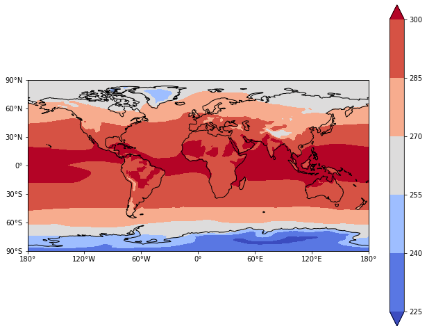
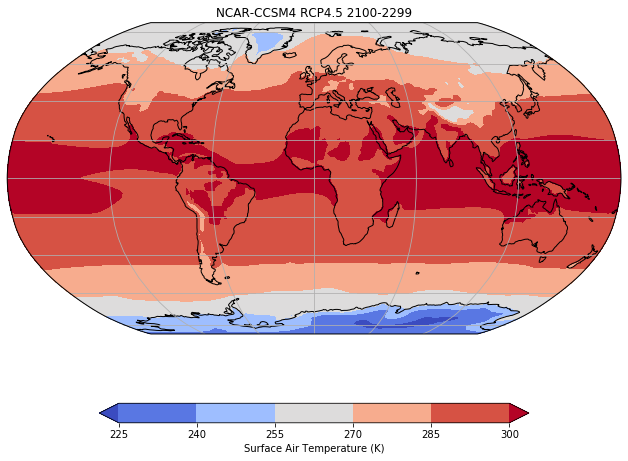

### Cartopy

`cartopy` is a Python map plotting package. 
It was originally developed by meteorologists at the UK Met Office, 
as plotting gridded model output and observational data onto easy-to-read maps is a common task in the field.
Combined with `matplotlib` it works well for making contour plots of maps for Climate Data Analysis

This lesson will demonstrate how to make contour plots using `cartopy`.

## Plotting Gridded Data

We will use CMIP5 data for surface air temperature (tas) from the RCP8.5 scenario produced by the NCAR/CCSM4 model. For this example, we will use only the first ensemble member.

The data are located in the following directory on Hopper: `/home/pdirmeye/classes/clim680_2022/cartopy_data/`

The filename is: `tas_Amon_CCSM4_rcp45_r1i1p1_210101-229912.nc`

In a new Jupyter notebook (call it `cartopy_test.ipynb`) type into the code cell:

> ~~~
> import numpy as np
> import xarray as xr
> import matplotlib.pyplot as plt
> 
> import cartopy.crs as ccrs
> import cartopy.mpl.ticker as cticker
> from cartopy.util import add_cyclic_point
> ~~~
{: .source}

Because you are only reading the dataset, not editing or changing it, 
and it resides on the same computing system where you are running your Jupyter notebook, 
you do <u>not</u> need to copy it to your directory. Instead, we will give the path to the dataset.

In a new code cell, type:

> ~~~
> path = '/home/pdirmeye/classes/clim680_2022/cartopy_data/'
> fname = 'tas_Amon_CCSM4_rcp45_r1i1p1_210101-229912.nc'
> ds = xr.open_dataset(path+fname)
> ds
> ~~~
{: .source}

You should see a display of the contents of the file, including metadata. 
Note we did not use the print statement to display `ds`.
This is a shortcut that works only if it is the last line in the cell.

Let’s take the mean temperature over the entire period for our plots

> ~~~
> ds_mean=ds.mean(dim='time')
> ~~~
{: .source}

If we just use `plt.contourf` from `matplotlib`, we get this:

> ~~~
> plt.contourf(ds_mean['tas'])
> plt.colorbar() 
> ;
> ~~~
{: .source}

## Plot with a map

However, we would like to plot this with map and control the side, 
the map projection, label the lats and lons, etc.

> ~~~
> # Make the figure larger
> fig = plt.figure(figsize=(11,8.5))
> 
> # Set the axes using the specified map projection
> ax=plt.axes(projection=ccrs.PlateCarree())
> 
> # Make a filled contour plot
> ax.contourf(ds['lon'], ds['lat'], ds_mean['tas'],
>             transform = ccrs.PlateCarree())
> 
> # Add coastlines
> ax.coastlines() 
> ;
> ~~~
{: .source}

## Cyclic data and lat-lon labels

This figure has a couple of things we would like to change: 

1. The stripe at 0 lon. This is due to the fact that `contourf` has no way to know that our data is cyclic in longitude. The fact that the Earth is round befuddles many plotting packages like `matplotlib`. `cartopy` has a fix for this using `cartopy.util.add_cyclic_point` 
2. No labels for the latitude and longitude. We will add lat-lon labels using `set_x(y)ticks` and `cticker`.

Make a copy of your cell (shortcut: click on the right side of the cell so a highlight bar appears.
Then type: `c` `v` -- it will copy the cell and paste the copy below it).

> ~~~
> # Make the figure larger
> fig = plt.figure(figsize=(11,8.5))
> 
> # Set the axes using the specified map projection
> ax=plt.axes(projection=ccrs.PlateCarree())
> 
> # Add cyclic point to data
> data=ds_mean['tas']
> data, lons = add_cyclic_point(data, coord=ds['lon'])
>
> # Make a filled contour plot
> cs=ax.contourf(lons, ds['lat'], data,
>             transform = ccrs.PlateCarree())
>
> # Add coastlines
> ax.coastlines()
> 
> # Define the xticks for longitude
> ax.set_xticks(np.arange(-180,181,60), crs=ccrs.PlateCarree())
> lon_formatter = cticker.LongitudeFormatter()
> ax.xaxis.set_major_formatter(lon_formatter)
>
> # Define the yticks for latitude
> ax.set_yticks(np.arange(-90,91,30), crs=ccrs.PlateCarree())
> lat_formatter = cticker.LatitudeFormatter()
> ax.yaxis.set_major_formatter(lat_formatter) 
> ;
> ~~~
{: .source}

The colors are not very nice for plotting temperature contours. 
Let’s choose a different colormap and add a colorbar. 
The [colormap options](https://matplotlib.org/stable/gallery/color/colormap_reference.html){:target="_blank" rel="noopener"} 
come from `matplotlib`. 
We will choose one called **coolwarm**

> ~~~
> # Make the figure larger
> fig = plt.figure(figsize=(11,8.5))
>
> # Set the axes using the specified map projection
> ax=plt.axes(projection=ccrs.PlateCarree())
>
> # Add cyclic point to data
> data=ds_mean['tas']
> data, lons = add_cyclic_point(data, coord=ds['lon'])
> 
> # Make a filled contour plot
> cs=ax.contourf(lons, ds['lat'], data,
>             transform = ccrs.PlateCarree(),cmap='coolwarm',extend='both')
> 
> # Add coastlines
> ax.coastlines()
> 
> # Define the xticks for longitude
> ax.set_xticks(np.arange(-180,181,60), crs=ccrs.PlateCarree())
> lon_formatter = cticker.LongitudeFormatter()
> ax.xaxis.set_major_formatter(lon_formatter)
> 
> # Define the yticks for latitude
> ax.set_yticks(np.arange(-90,91,30), crs=ccrs.PlateCarree())
> lat_formatter = cticker.LatitudeFormatter()
> ax.yaxis.set_major_formatter(lat_formatter)
> 
> # Add colorbar
> cbar = plt.colorbar(cs) 
> ;
> ~~~
{: .source}

## Change the map projection

What if we want to use a different map projection? 
There are many 
[map projections](https://scitools.org.uk/cartopy/docs/latest/reference/projections.html){:target="_blank" rel="noopener"}
available.
Let's use the Robinson projection. We'll also give the plot a title and label the colorbar:

> ~~~
> # Make the figure larger
> fig = plt.figure(figsize=(11,8.5))
> 
> # Set the axes using the specified map projection
> ax=plt.axes(projection=ccrs.Robinson())
> 
> # Add cyclic point to data
> data=ds_mean['tas']
> data, lons = add_cyclic_point(data, coord=ds['lon'])
> 
> # Make a filled contour plot
> cs=ax.contourf(lons, ds['lat'], data,
>             transform = ccrs.PlateCarree(),cmap='coolwarm',extend='both')
>
> # Add coastlines
> ax.coastlines()
> 
> # Add gridlines
> ax.gridlines()
> 
> # Add colorbar
> cbar = plt.colorbar(cs,shrink=0.7,orientation='horizontal',label='Surface Air Temperature (K)')
> 
> # Add title
> plt.title('NCAR-CCSM4 RCP4.5 2100-2299')
> ;
> ~~~
{: .source}

> ## Good code editing habits
>
> One of the most frustrating things that happens when writing code is when you have a program that works,
> but you want to make an improvement.
> You change one little thing, and it stops working. 
> Then you try to change it back, and it's still broken because something is not exactly like it was.
> 
> You should never change working code unless you are replacing it with newer working code.
> If you have cell in a Jupyter notebook that does what you want, but you wish to improve it, 
> make a copy of the cell and work on the copy until you get it as you want it.
> Then, delete the old cell.
> 
> Likewise for an entire working notebook, script or program.
> Copy the file and work on the copy. 
> When you have a new and improved version, replace the original, or just give it a newer version number.
> This version numbering approach is at the heart of robust code maintenance practices.
> Combined with clear and complete documentation
> (inline comments in your code, and good use of markdown cells to describe your cells), 
> these practices will 
> cost you a little extra time now, but save you a lot of time later.
> 
> A good philosophy is:
> 1. Write all your code as if other people will read it.
> 2. Write all your code like your future self will depend on it!
> 
{: .callout}

  
  

